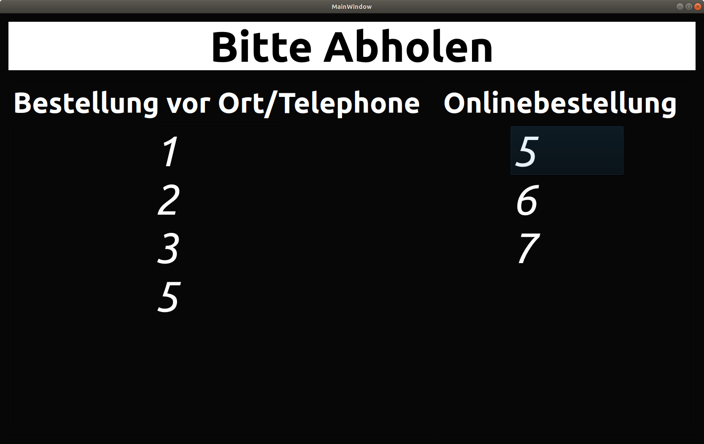
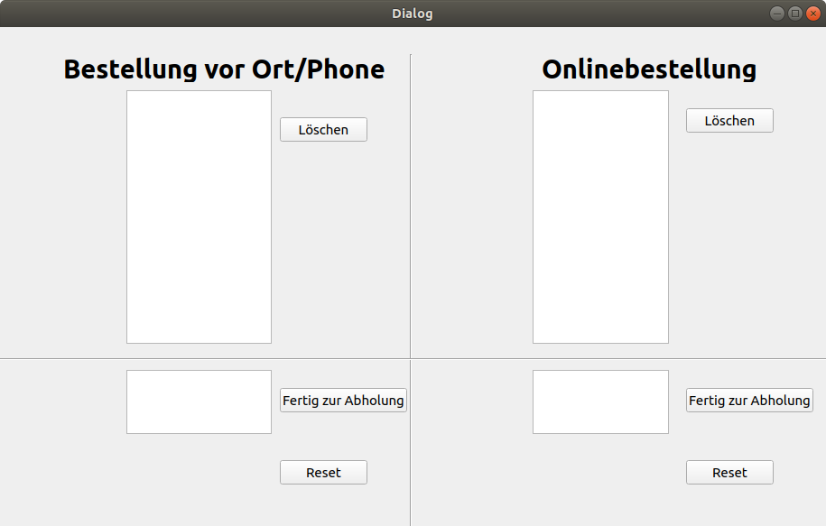

# Ready4Takeaway

##Description

Displays the dishes which are ready for take-away for customers of restaurants.
The program starts two applications: the command_center and an GUI for customers.
Recommendation: the User-GUI should be displayed on a TV (>=43 inch), which is connected to a main notebook. The command center should be used on the main notebook to change the list.

User GUI is as follows:


The command_center is as follows.



##Set up:
We need to set up pip and pyqt5. Qt5-designer is optional and only needed if you want to change the GUI 

### Linux: 
Set up and activate your pip env
```bash
sudo apt install virtualenv
virtualenv your_env --python=python3
source your_env/bin/activate
```
### Windows: 
- Download any python3 version.
- python3.6 is here https://www.python.org/downloads/release/python-360/
- During installation: click on custom installation, then add python to system environment


### Dependencies:
```bash
pip install -r requirements.txt
```
(Optional): install qt5-designer to modifiy the gui
```bash
sudo apt install qt5-designer 
```
# Run:
```bash
python main.py
```


### GUI modification: 
open qt5-designer
change controll_ui and user_ui according to preferences
'compile' your ui files to python format using
```bash
pyuic5 controll_ui.ui controll_ui.py 
pyuic5 user_ui.ui user_ui.py 
```

